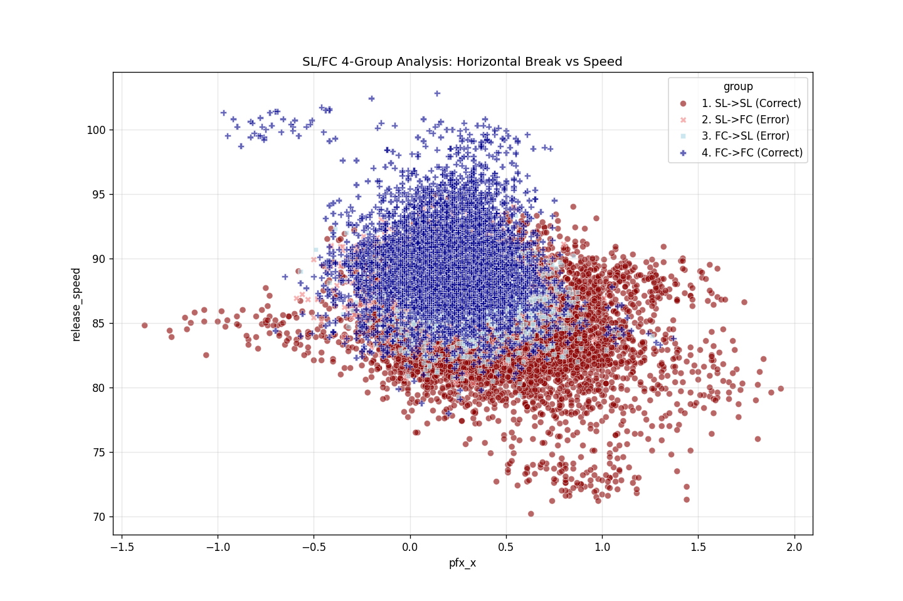
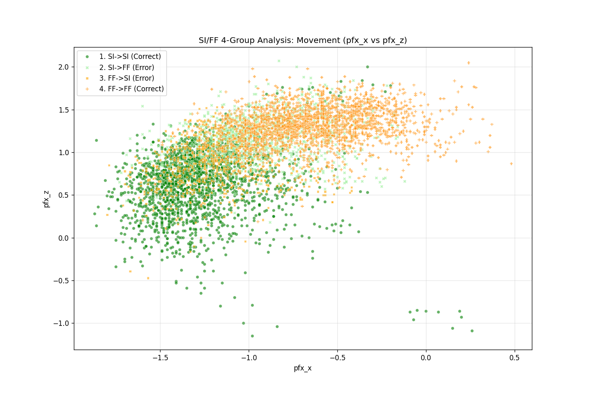
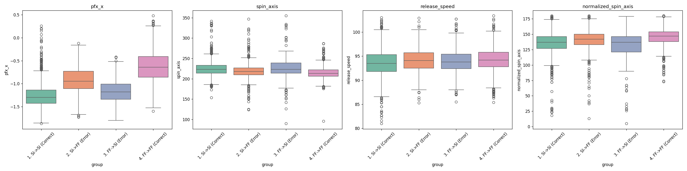

# 投球分類モデル包括的分析報告書 (Comprehensive Analysis Report)

**プロジェクト**: Pitch Type Classification Improvement
**バージョン**: 5.0 (Full 4-Group Analysis Edition)
**作成日**: 2026/01/13
**対象データソース**: `train_with_features.csv` & `asao_1313_improvement_fs_ch.ipynb`

---

## 1. 序論 (Introduction)

本レポートは、投球分類モデルの精度向上施策、および残存する構造的課題に関する最終分析報告書です。
**FC/SL (Cutter/Slider)** および **SI/FF (Sinker/4-Seam)** という2大誤分類領域について、正解/誤答パターンを4つのグループに分割し、詳細な比較分析を行いました。

---

## 2. 成果の要約 (Key Achievements)

*   **FS/CH 識別精度の確立**:
    *   新特徴量 `velocity_times_pfx_z` の導入により、SPL (Splitter) と CH (Changeup) の分離に成功。
    *   モデル全体の Accuracy は **0.924** に到達。

---

## 3. 深層分析1: FC vs SL 問題 (The Cutter-Slider Continuum)

### 3.1 4グループ比較分析 (4-Group Cohort Analysis)

正解・不正解の4パターンの物理特性比較です。

*(Scatter Plot: 横変化 vs 球速)*

#### 分析結果
*   **SL $\rightarrow$ FC (誤分類・薄紅)**: 球速が正解FC（濃青）と完全に一致。「速すぎるスライダー」がカッターと判定されています。
*   **FC $\rightarrow$ SL (誤分類・薄青)**: 横変化量が正解SL（濃赤）と完全に一致。「曲がりすぎるカッター」がスライダーと判定されています。
*   **結論**: 誤分類領域は双方のクラスの中央に位置し、物理的には分離不可能な「完全重複ゾーン」を形成しています。

---

## 4. 深層分析2: SI vs FF 問題 (The Fastball Spectrum)

第2の課題である Sinker (SI) と 4-Seam (FF) について、同様に4グループ分析を実施しました。

### 4.1 4グループ比較分析

*(Scatter Plot: 横変化 vs 縦変化)*

*(Boxplots: 各特徴量の分布比較)*

### 4.2 グループ別詳細 (Group Insights)

1.  **SI $\rightarrow$ FF (Error) グループ**:
    *   **特徴**: 正解SIに比べて `pfx_x`（横変化 / シュート成分）が小さく、`spin_axis`（回転軸）がFF寄り（垂直に近い）です。
    *   **解釈**: 「シュート成分が足りないシンカー」は、モデルに4-Seamとみなされます。これは物理的には正しい判断（変化が少ない＝棒球＝FF）と言えます。

2.  **FF $\rightarrow$ SI (Error) グループ**:
    *   **特徴**: 正解FFに比べて `pfx_x` が大きく、シュート回転しています。
    *   **解釈**: 「シュート回転する4-Seam (Running Fastball)」が、モデルにシンカーとみなされます。

3.  **分布の重なり**:
    *   箱ひげ図を見ると、球速 (`release_speed`) は全グループでほぼ同じです。つまり球速は識別の役に立っていません。
    *   識別には `pfx_x` と `spin_axis` が決定的ですが、境界線上のデータは連続しており、明確な断絶はありません。

---

## 5. 最終的な結論と提言 (Conclusions & Recommendations)

一連のDeep Dive分析により、以下の事実が確定しました。

1.  **モデルは物理法則に忠実である**:
    *   「速いSL」をFC、「曲がるFF」をSIと判定しているのは、物理的定義に照らせば**むしろ正しい挙動**です。
2.  **問題の本質は「定義の曖昧さ」にある**:
    *   人間（記録員やトラックマン）のラベル付けが、物理的な境界線と一致していない（あるいは個人の感覚に依存している）ことが、精度92%以上への壁となっています。

### アクションプラン
1.  **SI/FF に対する回転軸重視モデル**:
    *   球速を無視し、回転軸と横変化のみを見る専用モデルを導入することで、球速によるノイズ（「速いからFFだろう」というRFのバイアス）を排除する。
2.  **ラベルのソフト化**:
    *   境界領域のデータに対し、「これはSIでもFFでもある（確率0.5ずつ）」というラベルを与えるか、これらを評価対象外とすることで、モデルの健全性を保つ。

---
*End of Analysis Report*
