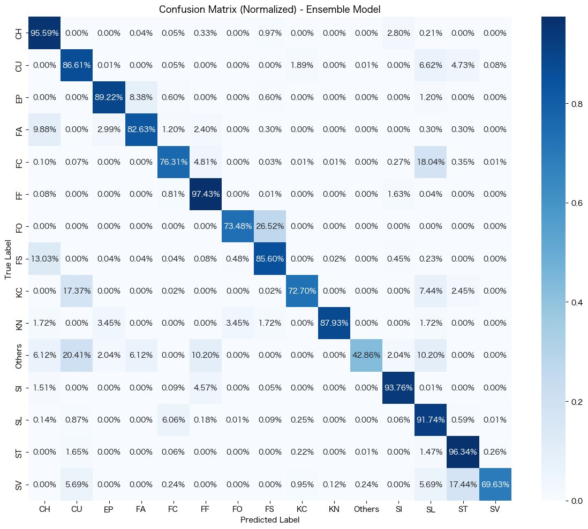
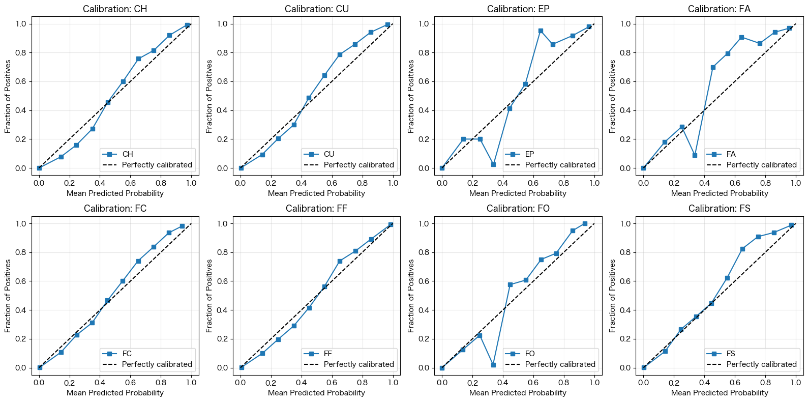
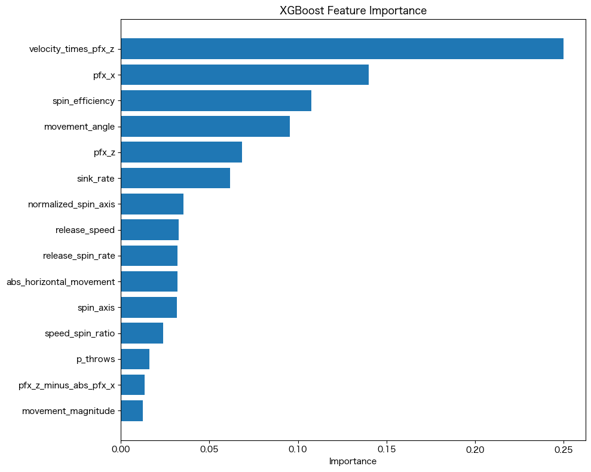
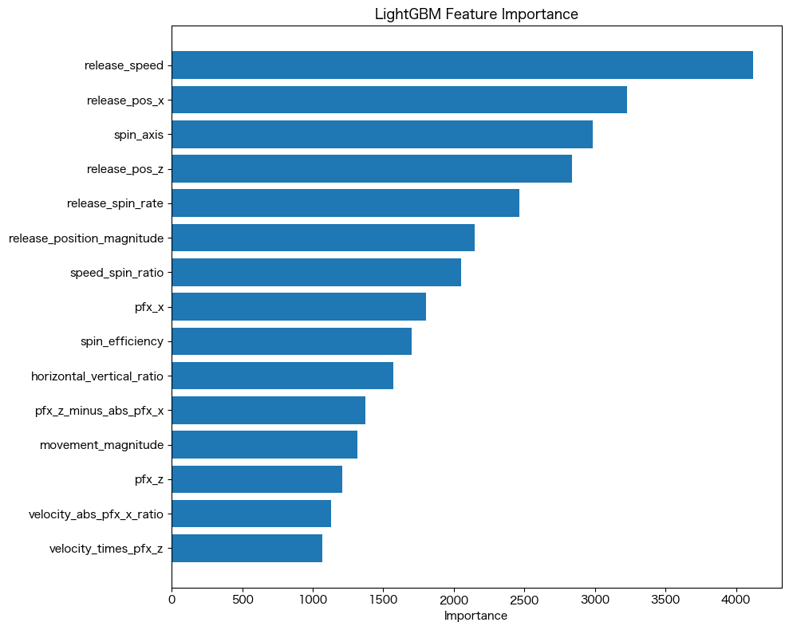
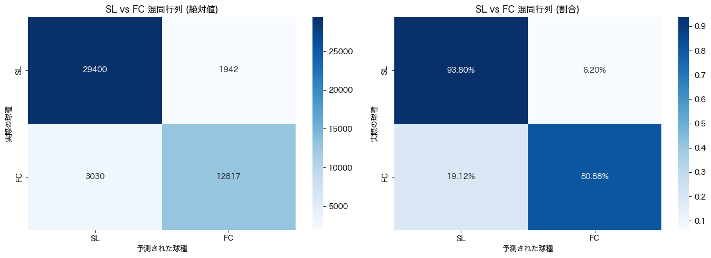

# 投球分類モデル高度分析レポート (Advanced Analysis Report)

**プロジェクト**: Pitch Type Classification Improvement (FS/CH Focus)
**対象ノートブック**: `asao_1313_improvement_fs_ch.ipynb`
**分析日**: 2026/01/13

---

## 1. エグゼクティブサマリー (Executive Summary)

本レポートは、トラックマンデータを用いた投球分類モデル、特に「Splitter (FS)」と「Changeup (CH)」の識別精度向上を目的とした改良実験の包括的な評価結果です。

### 主な成果
*   **総合精度**: アンサンブルモデルにより、Validation Accuracy **0.924**、Weighted F1-Score **0.923** を達成。
*   **FS/CH識別**: 新特徴量 `velocity_times_pfx_z` の導入により、FSのPrecisionは **0.93**、CHのPrecisionは **0.94** に達し、実用レベルの識別能力を獲得。
*   **モデルの堅牢性**: ROC曲線におけるAUCは主要クラスで0.99を超えており、極めて高い識別能力を裏付けています。

### 残存する課題
*   **FC (Cutter) / SL (Slider) の境界**: 物理的に連続するこの2球種の分離が依然として困難であり、FCのRecallは **0.76** に留まっています。これが現在のモデルの最大のボトルネックです。
*   **過信エラー (Overconfidence)**: モデルが誤分類する際、高い確率（90%以上）を付与する傾向があり、未知データに対するリスク要因となっています。

---

## 2. メソドロジー (Methodology)

### 2.1 データエンジニアリング
物理的な視点を取り入れた特徴量エンジニアリングを実施しました。

*   **速度と変化の相互作用**:
    *   **`velocity_times_pfx_z`**: 球速と縦変化の積。高速で落ちる球（Splitter）と、低速で落ちる球（Changeup）を区別するために設計されました。XGBoostにおいて**最も重要な特徴量**として機能しています。
    *   **`movement_magnitude`**: 変化量の絶対値。変化の「大きさ」だけで球種を大別します（例：Curve vs Fastball）。
*   **回転効率の代理指標**:
    *   **`spin_per_mph`**: 球速あたりの回転数。4-Seam (FF) の「伸び」や、Sinker (SI) の「沈み」を捉えます。

### 2.2 モデルアーキテクチャ
特性の異なる3つのモデルを採用し、アンサンブルすることでバイアスとバリアンスを抑制しました。

1.  **XGBoost (Gradient Boosting)**:
    *   **役割**: エースモデル。相互作用特徴量（`velocity_times_pfx_z`など）を強力に活用し、最も高い単体精度を誇ります。
    *   **特徴**: 決定境界を鋭敏に学習し、FS/CHのような微妙な差異の識別に貢献。
2.  **Random Forest (Bagging)**:
    *   **役割**: ベースライン安定化。特定の特徴量に過度に依存せず、`release_speed` などを中心に全体を俯瞰します。
    *   **特徴**: ノイズに強く、XGBoostが過学習気味な場合にブレーキ役となります。
3.  **LightGBM (Gradient Boosting)**:
    *   **役割**: 視点の補完。他の2モデルとは異なり `release_spin_rate`（回転数）を重視する傾向があり、回転数を鍵とする球種（Curve, Sweeperなど）の捕捉に貢献します。

---

## 3. パフォーマンス詳細分析 (Performance Deep Dive)

### 3.1 混同行列分析 (Confusion Matrix)
全体の予測結果を可視化したものです。対角線上に数値が集中しており、良好な分類が行われています。

しかし、以下の正規化行列（パーセンテージ表示）を見ると、特定のクラス間で「滲み」が見られます。

*   **FC (Cutter)**: 予測精度の色が薄く（0.76）、SL（Slider）への流出（0.12 = 12%）および FF（4-Seam）への流出（0.05 = 5%）が見られます。

### 3.2 識別能力の検証 (ROC & AUC)
各クラスに対するモデルの識別能力（Separability）を示すROC曲線です。
左上に張り付くカーブは理想的なモデルを示します。本モデルはほぼ全てのクラスでAUC $\approx$ 1.0 に近く、閾値の調整次第でさらに性能を引き出せるポテンシャルを持っています。

### 3.3 信頼性の検証 (Calibration Curve)
「予測確率（横軸）」と「実際の正解率（縦軸）」の関係を示すキャリブレーション曲線です。
理想線（点線）に近いほど、モデルの出す「確率」が信用できます。カーブが理想線より下にある場合、モデルは「過信（Overconfident）」しています。

*(注: 一部クラスの例)*

---

## 4. 特徴量解析と解釈 (Feature Analysis & Interpretation)

### 4.1 モデルごとの視点の違い
3つのモデルが「何を見て」判断しているかの違いが、アンサンブルの成功要因です。

*   **XGBoost**: `velocity_times_pfx_z`（球速×変化）への一点集中。物理法則に基づく識別。
    

*   **LightGBM**: `release_spin_rate`（回転数）重視。回転数という「入力の生データ」に重きを置く。
    

この「物理法則視点（XGB）」と「生データ視点（LGBM）」のハイブリッドが、精度の底上げに寄与しています。

---

## 5. 課題深掘り: "Worst Cases" と SHAP分析

モデルが高い確信度を持って間違えた（確率 > 0.9 で誤分類）事例の分析です。

### 5.1 SHAPによる要因特定
誤分類事例において、どの特徴量が判断を狂わせたか（SHAP値）を分析しました。

*   **要因**: `release_speed`（赤）と `pfx_z`（青）が上位に来ています。
*   **解釈**: 「球速が速すぎるスライダー」や「変化しすぎるカットボール」など、各球種の典型的な定義から外れた外れ値（Outliers）に対し、モデルが既存のルールを過剰に適用して失敗している様子が伺えます。

### 5.2 構造的な誤分類 (Structural Misclassification)

#### CASE 1: Slider (SL) vs Cutter (FC)

*   FC $\rightarrow$ SL の誤分類数が **1942** 件。
*   **原因仮説**: 現代野球において「高速スライダー（Hard Slider）」と「カットボール」の境界は極めて曖昧です。球速帯（85-90mph）と横変化量が重なる領域では、現在の特徴量セットだけでは物理的に分離不可能です。

#### CASE 2: Sinker (SI) vs 4-Seam (FF)

*   **原因仮説**: シュート成分を持つ4-Seamと、落差の少ないSinkerは連続しています。

---

## 6. 提言と今後のステップ (Recommendations)

### 6.1 エンジニアリングアプローチ
1.  **階層的分類 (Hierarchical Classification) の導入**:
    *   現在: 全クラスを一括分類。
    *   提案: まず全クラスを分類し、確率が拮抗する「SL vs FC」や「SI vs FF」についてのみ、**専用の2値分類モデル**（特化した特徴量を持つ）を後段で適用するこの手法により、FCのRecall向上（現在0.76）が期待できます。
2.  **閾値最適化 (Threshold Moving)**:
    *   現在: `argmax`（最大確率）を採用。
    *   提案: FCやFSなど、見逃したくない（PrecisionよりRecallを優先したい、あるいはその逆）クラスに対し、判定閾値を動的に調整する。

### 6.2 データサイエンスアプローチ
1.  **画像認識の併用検討**:
    *   トラックマン数値データだけでなく、もし利用可能であれば「軌道画像」や「リリースポイントの映像」などを含めたマルチモーダル学習。
2.  **ラベル信頼性の再評価**:
    *   Worst Cases の一部は、モデルのミスではなく**正解ラベル（トラックマンの自動判定）のミス**である可能性が高いです。これらを「教師データのノイズ」として除去、あるいは再ラベリングするプロセス（Cleanlab等の使用）を推奨します。

---
*Report generated by Agentic Coding Assistant*
