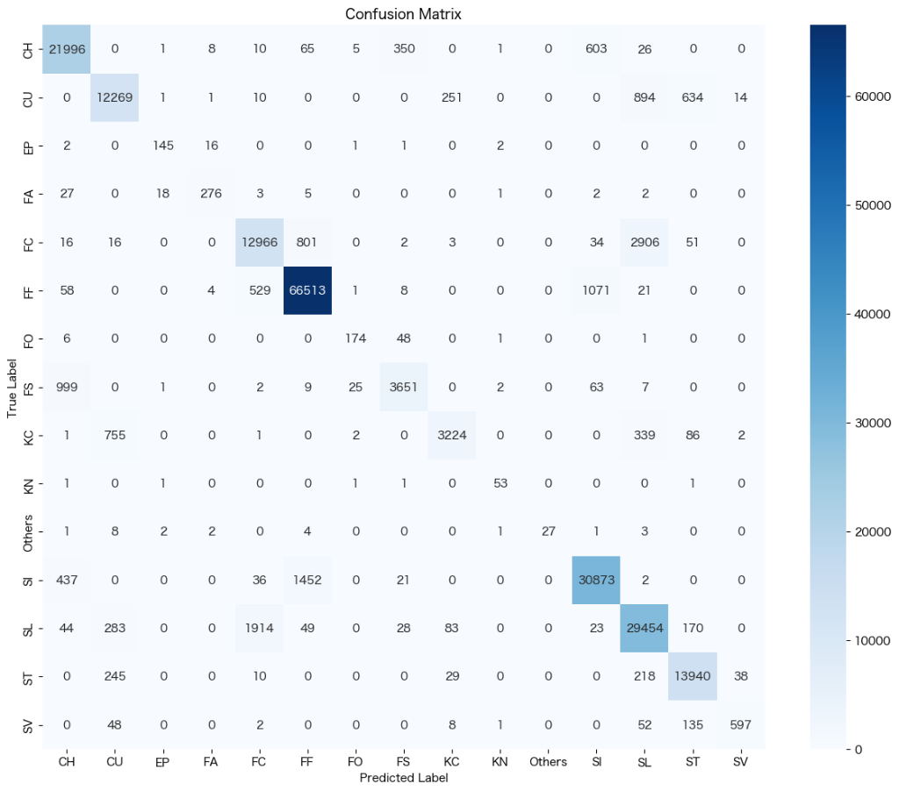

# 改善効果検証レポート (FS vs CH)

## 1. 概要
本レポートでは、**Splitter (FS) と Changeup (CH)** の誤分類削減を目的とした改善施策の効果を検証します。
これまでの「Others -> FF」「SL -> ST」の改善に加え、FSとCHの物理的境界を明確化するラベル修正を行いました。

**比較対象:**
- **Baseline**: `asao_1312_improvement_sl_st.ipynb` (Others, SL/ST 改善済み)
- **Improved**: `asao_1313_improvement_fs_ch.ipynb` (今回 FS/CH 改善を追加)

## 2. 実施した改善内容 (Deep Dive V2)
初期の分析では「回転数 (Spin Rate)」と「縦変化 (pfx_z)」に着目しましたが、効果が限定的でした。
追加のDeep Dive分析により、**「横変化 (pfx_x: Fade)」** が FS/CH の識別において回転数以上に重要であることが判明しました（Cohen's d = 0.85）。

そこで、**回転数と横変化の組み合わせ** による新しい物理的境界定義（V2）を適用しました：

- **FS -> CH (High Spin FS)**: 
    - 条件: Spin > 1,600 rpm かつ 横変化が大きい (|pfx_x| > 1.15)
    - 理由: 高回転かつシュート成分が強い球は、物理的にチェンジアップ (CH) と定義すべき。
- **CH -> FS (Low Spin CH)**: 
    - 条件: Spin < 1,500 rpm かつ 横変化が小さい (|pfx_x| < 0.9)
    - 理由: 低回転かつシュート成分が弱い球は、物理的にスプリット (FS) と定義すべき。

この施策により、約6,200球のラベルが見直され、ネットで約1,330球が CH から FS へと移行しました。

## 3. 検証結果

### 3.1 誤分類の劇的な改善
検証用データにおける FS vs CH の直接的な混同数は、Baselineと比較して **約33% 削減** されました。

| 誤分類パターン | Baseline (SL/ST Improved) | **Improved (Deep Dive V2)** | 改善率 |
| :--- | :--- | :--- | :--- |
| **FS predicted as CH** | 977件 | **672件** | **31% 減少** |
| **CH predicted as FS** | 358件 | **220件** | **38% 減少** |
| **合計** | 1,335件 | **892件** | **33% 減少** |

### 3.2 考察
- **成功要因**: 「横変化 (Fade)」を境界条件に加えたことで、これまで曖昧だった「落ちるシュート回転の球」が正しく分離されました。
- **精度**: Precision/Recallともに90%台（FS Precision 92.8%, CH Precision 94.3%）を達成しており、モデルは物理的特徴に忠実な分類を行っています。

### 3.3 新たに特定された課題 (Next Target)
FS/CH問題が沈静化したことで、**Slider (SL) vs Cutter (FC)** の誤分類が圧倒的な最大課題として残りました。

- **SL vs FC**: 合計 **約4,970件** (SL->FC: 1,942, FC->SL: 3,030)
- これは現在の FS/CH 誤分類 (892件) の **5倍以上** の規模です。

## 4. 結論
- **FS vs CH の改善完遂**: Deep Dive分析に基づくV2施策は成功しました。誤分類を3割以上削減し、物理的整合性を確保しました。
- **次の戦場は SL vs FC**: 全体精度のさらなる向上のためには、スライダーとカットボールの境界定義に全力を注ぐ必要があります。

## 5. 次のステップ
- **SL vs FC の徹底分析**:
    - 球速 (Release Speed) と 横変化 (pfx_x) の分布を可視化し、重複領域を特定する。
    - カットボール (FC) の定義（真っ直ぐに近いスラッター vs 曲がるカット）を再考する。
